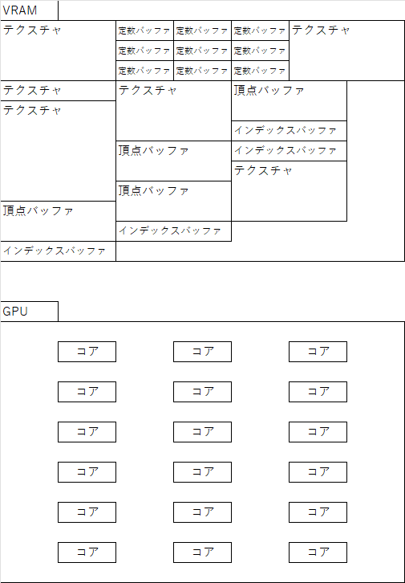
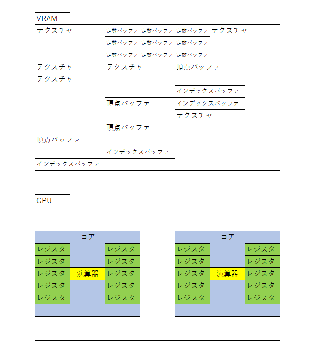
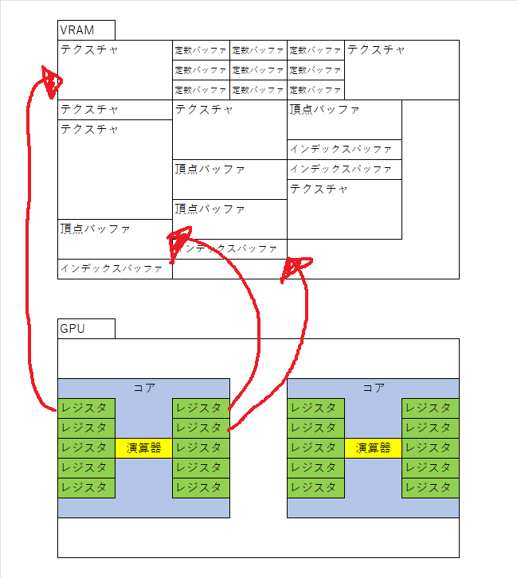
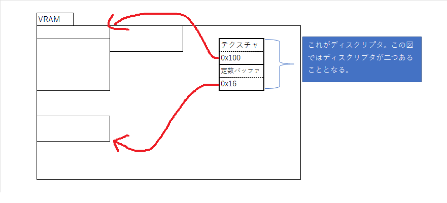
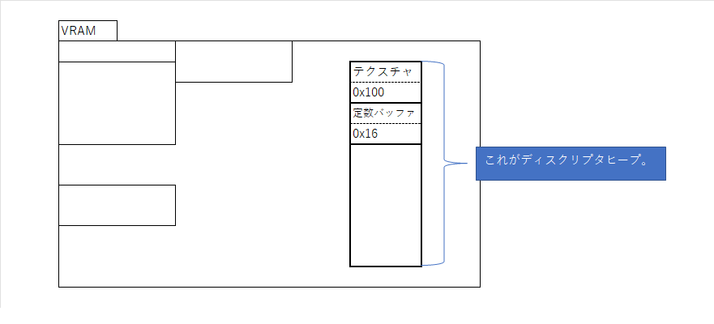

# Chapter1 リソースバインディング

&emsp;このチャプターではDirectX12におけるリソースバインディングの仕組みについて見てきます。

## 1.1 リソースバインディングとは？
&emsp;では、リソースバインディングについて解説をしたいのですが、これを解説するには昨今のGPUのアーキテクチャについて多少の前提知識が必要になるので、それについて勉強していきましょう。
&emsp;昨今の高品質なゲームを快適に遊ぶためにはグラフィックカードが必須となります。現在のグラフィックカードは主にNVIDIA製のものとAMD製のモノがあります。(IntelのCPUに内蔵されているUHDグラフィックスなどのインテル製のチップもありますが、このチップはあくまでも一般ユーザー向けのチップとなっており、高品質なゲームを遊びたいゲームユーザー向けではないため、割愛します。)
&emsp;これらのグラフィックカードの構成を大雑把に説明すると、演算を行うGPU、テクスチャなどのデータを記憶するVRAMに分類することができます(図1.1)。</br>
[図1.1 GPUとVRAM～その1]</br>
</br>

&emsp;さて、グラフィックカードを大雑把に見てみるとGPUとVRAMがあることが分かりました。では、もう少し詳細にGPUのアーキテクチャについて見ていきましょう。図1.2を見てください。</br>
[図1.2 GPUとVRAM～その2]</br>
</br>
&emsp;GPUの内部には多数のコアと呼ばれる演算基が含まれており、前述したシェーダープログラムの実行はこのコアを使って並列に実行されます。例えば、100万頂点のモデルの描画コールを実行した場合、このコアで分担して100万頂点の頂点シェーダーを実行していくことになります。また、VRAMにはシーンを描画するために必要な各種リソースが乗っています。さて、そろそろリソースバインディングに関する話に近づいているのですが、もう少しだけグラフィックカードのアーキテクチャを詳細に見ていきましょう。図1.3を見てください。</br>
[図1.3 GPUとVRAM～その3]</br>
</br>
&emsp;図1.3ではコアの内部情報を詳細に記載しています。コアの内部には数値演算を行うための演算器と高速なメモリのレジスタがあります。この演算器でシェーダープログラムを実行していると考えてください。ここで重要なのはレジスタです。シェーダープログラムが直接アクセスできるメモリはこのレジスタに乗っているデータになります。さて、ここで少しGPUの動きを考えてみましょう。アプリケーション側からユニティちゃんを描画するためのドローコールが実行されるとGPUはユニティちゃんを描画するためにレンダリングパイプラインを実行していきます。このパイプライン上に頂点処理を行う頂点シェーダーやピクセル処理を行うピクセルシェーダーが実行されていくわけです。この時、頂点シェーダーでは当然VRAMに乗っているユニティちゃんの頂点バッファやインデックスバッファにアクセスする必要があります。ピクセルシェーダーではユニティちゃんのテクスチャにアクセスる必要があります。しかし、VRAMにはその他のオブジェクトの頂点バッファやテクスチャといったグラフィックリソースもVRAMに乗っているのです。では、GPUはどのようにして多数あるVRAM上のリソースから、Unityちゃんのグラフィックリソースを選べばいいのでしょうか。答えを言うと、GPUが自動的にユニティちゃんのグラフィックリソースを選ぶということはできません。プログラマが明示的にプログラムを記載して、ユニティちゃんのグラフィックリソースを指定する必要があります。もう少し具体的に言うと、GPUの各種レジスタに使用するグラフィックリソースのアドレスを設定するのです(図1.4)。
[図1.4 GPUとVRAM～その4]</br>
</br>
&emsp;イメージとしてはC++のポインタをイメージしてみてください。レジスタに使用するリソースのアドレスを設定して、そのアドレスを使ってリソースをロードしていきます。そしてこのレジスタと使用するリソースを関連付けすることをリソースバインディングといいます。DirectX12を利用して絵を描画するためには、後述するディスクリプタ、ディスクリプタヒープ、そしてルートシグネチャを活用して、描画したい絵に必要なリソースとレジスタの関連付けを行う必要があります。

## 1.1 ディスクリプタ
&emsp;まずはディスクリプタから見ていきます。ディスクリプタとはグラフィックメモリ内のリソースの情報が記述されているデータです。リソースというのは、単なるメモリの塊となります。ディスクリプタはそのメモリの塊がなんなか、テクスチャなのか定数バッファなのかはたまたストラクチャードバッファなのか、といった情報が記述されています(図1.5)。
[図1.5 ディスクリプタ]</br>
</br>
&emsp;DirectX12のAPIを使ったリソースバインディングでは各種レジスタと、このディスクリプタを関連付けしていくことになります。


## 1.2 ディスクリプタヒープ
&emsp;続いてディスクリプタヒープです。これはディスクリプタを記憶するためのメモリ領域です。ディスクリプタの配列のようなものだと考えてもらって買いません。DirectX12ではディスクリプタを作成する前に、ディスクリプタヒープを確保して、そこにリソース情報(ディスクリプタ)を記憶していきます(図1.6)。
[図1.6 ディスクリプタヒープ]</br>
</br>
&emsp;ディスクリプタヒープは単にディスクリプタを記憶するためのメモリ領域です。その領域にリソースの情報を記述していくことになります。下記のコードはディスクリプタヒープとディスクリプタの関係を示したC++の疑似コードです。

```cpp
struct Descriptor{
    void* addr; // リソースのアドレス。
    int type;   // リソースの種類。
}
// ディスクリプタヒープを100バイト確保。
void* descriptorHeap = malloc( 100 );

Descriptor* descriptor = (Descriptor*)descriptorHeap;
// テクスチャの情報を書き込む。
descriptor[0].addr = 0x100;     // アドレス。
descriptor[0].type = 1;         // 1はテクスチャを表している。
// 次は定数バッファ。
descriptor[1].addr = 0x200;     // アドレス
descriptor[1].type = 2;         // 2は定数バッファを表している。
```

## 1.3 ルートシグネチャとディスクリプタテーブル

&emsp;最後にルートシグネチャとディスクリプタテーブルです。正確にはここの話はディスクリプタテーブルに関する説明なのですが、ディスクリプタテーブルの情報はルートシグネチャの内部のデータとなるので、ルートシグネチャとディスクリプタテーブルという節タイトルになっています。ディスクリプタテーブルはレジスタ番号からディスクリプタのアドレスに変換するためのテーブルです。</br>
&emsp;1.2節までディスクリプタとディスクリプタヒープについて話をしてきましたが

# Chapter2 パイプラインステート

# Chapter3 Zテスト

# Chapter4 アルファテスト

# Chapter5 カリング

