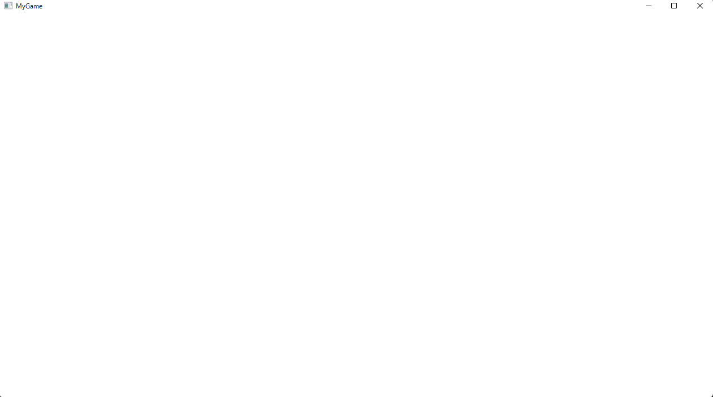
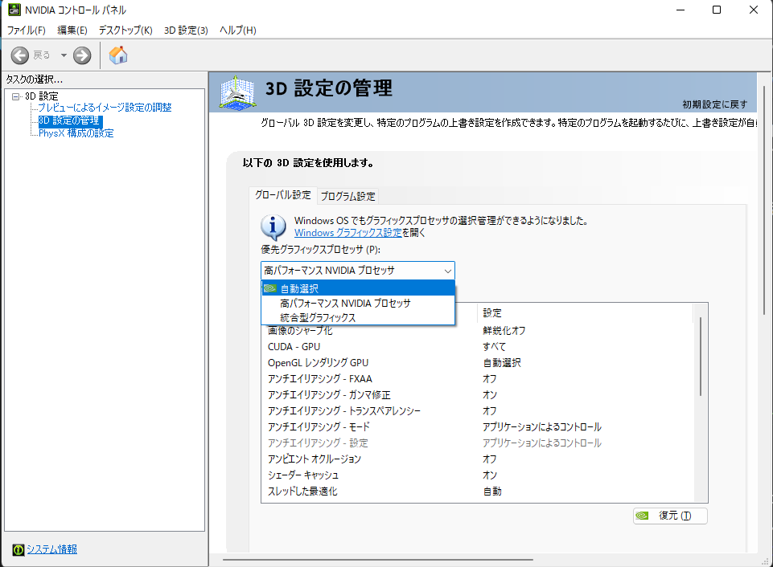
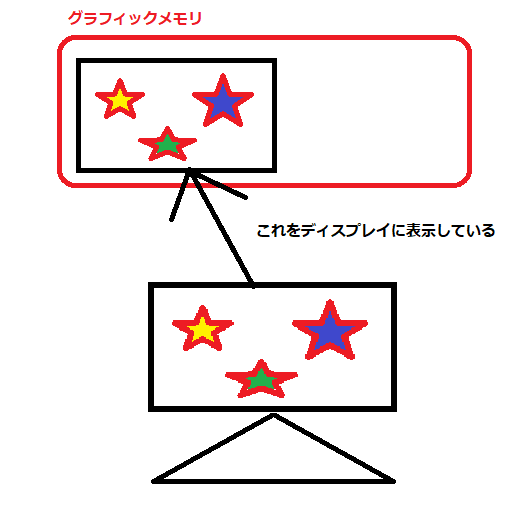
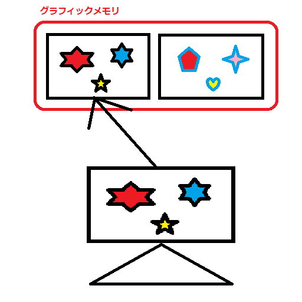
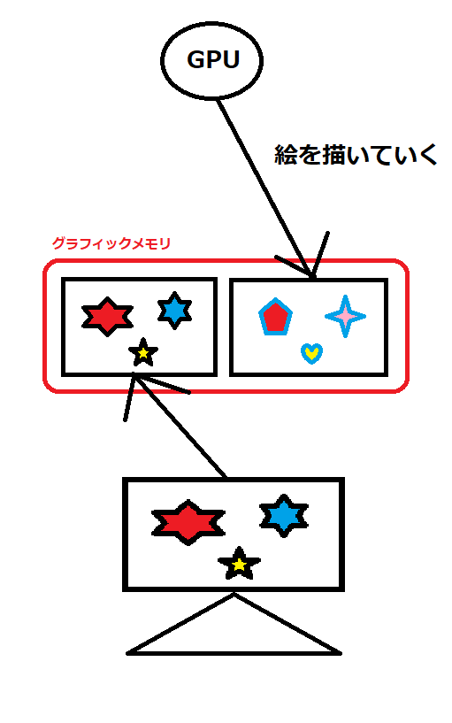
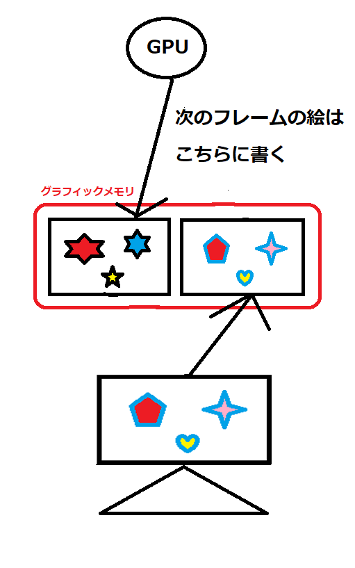
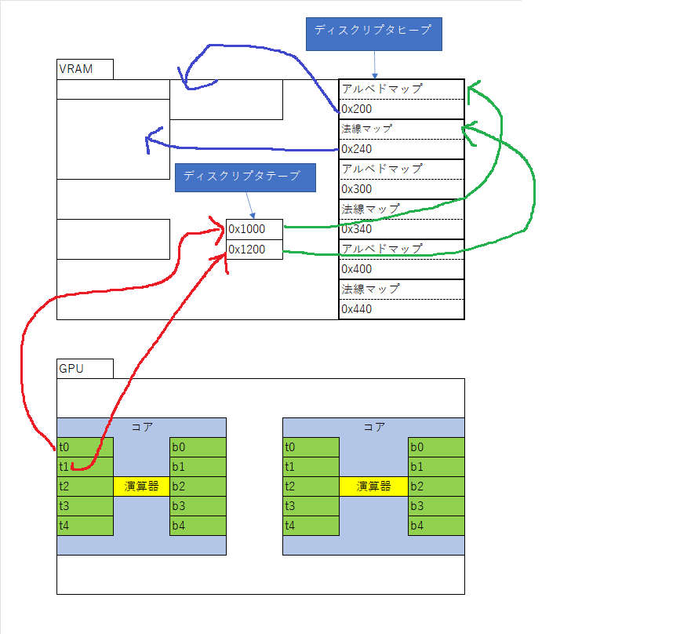

# Chapter 1 ウィンドウの作成～メッセージループ
&emsp;このチャプターではDirectX12を扱う前に、WindowsSDKを利用して、ゲームの絵を表示するためのウィンドウを表示、制御する方法について見ていきます。

## 1.1 WindowsSDKとDirectX12
&emsp;ウィンドウズ上で動作するゲームを作成するためには、まずウィンドウを作成する必要があります。このウィンドウを作成するAPIを提供しているのはDirectXではなく、WindowsSDKというソフトウェア開発キットになります。WindowsSDKは様々なAPIを含んでおり、その中にCreateWindow()関数、RgisterClassEX()関数、ShowWindos()関数など、ウィンドウアプリを作成するための様々なAPIがあります。実はDirectXもWindowsSDKの中に含まれているAPI群なのです。WindowsSDKを利用することによって、WindowsOS上で動作するグラフィカルなツールやゲームといったアプリを作ることができます。</br>
&emsp;DirectX、正確にはDirectXの中のDirect3Dは3Dグラフィックスを扱うためのAPI群となっています。ゲームではDirect3Dを使って、リアルタイム3DCGの絵を作成して、その絵を作成したウインドウに表示しているわけです。

## 1.2 ウィンドウの作成
&emsp;では、まずはウィンドウの作成に関する処理を見ていきましょう。ウィンドウを作成するステップは下記のようになります。
1. ウィンドウクラスの登録
2. ウィンドウの作成
3. ウィンドウの表示
 
&emsp;では、各ステップ詳細に見ていきましょう。

### 1.2.1 ウィンドウクラスの登録
&emsp;ウィンドウクラスとは作成するウィンドウの基本データとなります。ウィンドウの作成は後述するCreateWindow()関数を利用するのですが、この時にどのウィンドウクラス情報を使うのか？といった指定をすることになります。</br>
&emsp;ウィンドウの基本データの設定はWNDCLASSEXという構造体を利用します。基本データを設定することができたら、RegisterClassEx()関数を利用して、ウィンドウクラスを登録します。ウィンドウクラスのデータは使用するアイコン、マウスカーソル、ウィンドウの背景色などのデータを設定します。次のコードはウィンドウクラスの登録の疑似コードです。

```cpp
// ウィンドウクラスのパラメータを設定(単なる構造体の変数の初期化です。)
WNDCLASSEX wc =
{
    sizeof(WNDCLASSEX),         // 構造体のサイズ。
    CS_CLASSDC,                 // ウィンドウのスタイル。
    MsgProc,                    // 【重要】メッセージプロシージャ(後述)
    0,                          // ウインドウクラス構造体の後ろに割り当てる補足バイト数。多くの場合で0でよい。
    0,                          // ウインドウインスタンスの後ろに割り当てる補足バイト数。多くの場合で0でよい。
    GetModuleHandle(nullptr),   // このクラスのためのウインドウプロシージャがあるインスタンスハンドル。
    nullptr,                    // アイコンのハンドル。NULLの場合はデフォルト。
    nullptr,                    // マウスカーソルのハンドル。NULLの場合はデフォルト。
    nullptr,                    // ウィンドウの背景色。NULLの場合はデフォルト。
    nullptr,                    // メニュー名。NULLだとメニューなし。
    L"MyGame",                  // ウィンドウクラスに付ける名前。
    nullptr                     // 16×16の小さいサイズのアイコン。
};

// ウィンドウクラスの登録。
RegisterClassEx(&wc);
```
&emsp;さて、このデータの中で特に注目してほしいのが、メッセージプロシージャです。メッセージプロシージャは後ほど詳しく説明しますが、ゲーム以外のWindowsアプリを作る場合、特にGUIプログラミングを行う場合は心臓部分になるものとなります。

### 1.2.2 ウィンドウの作成
&emsp;ウィンドウクラスの登録ができたら、CreateWindow()関数を利用して、ウィンドウを作成します。ウィンドウを作成する際に、どの名前を使って、どのウィンドウクラスを利用するのかを指定します。イメージとしてはウィンドウクラスがtkmファイル、ウィンドウがModelクラスのインスタンスといった感じです。次のコードはウィンドウを作成する疑似コードです。

```cpp
// ウィンドウの作成
HWND hwnd = CreateWindow(
    L"MyGame",              // 使用するウィンドウクラスの名前。
    L"MyGame_00",           // ウィンドウの名前。
    WS_OVERLAPPEDWINDOW,    // ウィンドウスタイル。
    0,                      // ウィンドウの初期X座標。
    0,                      // ウィンドウの初期Y座標。
    1280,                   // ウィンドウの幅。
    720,                    // ウィンドウの高さ。
    nullptr,                // 親ウィンドウのハンドル。
    nullptr,                // メニューハンドル。
    hInstance,              // アプリケーションのインスタンス。
    nullptr,                // WM_CREATEメッセージのlParamパラメータとして渡される引数。
);
```


&emsp;CreateWindow()関数はウィンドウを識別するためのウィンドウハンドルを返してきます。ウィンドウハンドルというのは、ウィンドウを識別するためのハンドルです。マルチウィンドウのアプリケーションの場合、このウィンドウハンドルを利用してウィンドウを識別します。</br>

#### 1.2.2.1 ウィンドウハンドルとは？
&emsp;CreateWindow()関数を利用するとHWND型のウインドウハンドルが返ってくることを学びました。ウィンドウハンドルというのはウィンドウを識別するために使用されると記述しましたが、ではどのように識別するのでしょうか？答えはアドレスで識別します。実はHWND型は次のコードのように、ただのHWND__という構造体のポインタ型の別名定義です。

```cpp
// HWND__という構造体を定義する。
struct HWND__ {
    int unused;
};

// HWND__*を別名定義。
typedef struct HWND__* HWND;

```
&emsp;私は昔C言語を学び始めて数か月ほどでウィンドウハンドルに出会い混乱した覚えがありますが、ようはCreateWindow()関数は作成したウィンドウを表すオブジェクトのアドレスを返してきているだけです。そのアドレスを利用して、ウィンドウを識別するわけです。

### 1.2.3 ウィンドウの表示
&emsp;ウィンドウの表示はShowWindw()関数を利用します。ShowWindow()関数に表示したいウィンドウハンドルを渡すことでウィンドウを表示することができます。次のコードはウィンドウを表示する疑似コードです。

```cpp
// 作成したウィンドウを表示状態にする。
ShowWindow( hwnd, nCmdShow );
```

## 1.3 メッセージループ
&emsp;1.2節でウィンドウを作成して表示する処理について勉強しました。この処理はいわゆる初期化処理と呼ばれるものです。ウィンドウを作成することができたら、ユーザーのアクションに対して様々な反応を返す必要があります。例えば「✕ボタンを押されたらウィンドウを終了させる」や、「マウスの右クリックでポップアップメニューを出す」などです。このユーザーの反応に対するアクションはメッセージループと呼ばれるループ内に記述されます。イメージとしてはゲームループに近いです。実際ゲームでは、このメッセージループの一部がゲームループとなります。メッセージループの中でユーザーからのメッセージが処理されて、後述するメッセージプロシージャという関数が呼び出されることになります。次のコードはメッセージループの疑似コードです。

```cpp
// step-2 メッセージループを実装する。
MSG msg = { 0 };
// 終了メッセージが送られてくるまでループを回す。
while (WM_QUIT != msg.message) {
    // PeekMessage()関数を利用してウィンドウからのメッセージを受け取る。
    if (PeekMessage(&msg, NULL, 0, 0, PM_REMOVE))
    {
        // 仮想キーメッセージを文字メッセージに変換する。
        // ユーザーからの文字入力を取得する必要がある場合は、本関数を呼び出す。
        TranslateMessage(&msg);
        // メッセージを処理する。
        // この関数の中でウィドウクラスで指定したメッセージプロシージャー関数が呼ばれる。
        DispatchMessage(&msg);
    }
}
```
&emsp;このメッセージループではPeekMessage()関数、TranslateMessage()関数、DispatchMessage()関数の３つの関数が利用されています。PeekMessage()関数はユーザーが行った操作をメッセージという形で取り出します。例えば、マウスを動かした、右クリックした、左クリックしたといった情報です。取得したメッセージは第一引数のMSG構造体の変数に格納されます。TranslateMessage()関数はユーザーからの文字入力を処理する必要がある場合に呼び出します。仮想キーメッセージとなっているデータを扱いやすい文字データに変換してくれます。最後にDispatchMessage()関数ですが、この関数の中でウィンドウクラスの作成時に指定したメッセージプロシージャ関数が呼ばれます。

## 1.4 メッセージプロシージャ
&emsp;では、最後にメッセージプロシージャについて見ていきます。メッセージプロシージャとはユーザーからの入力を処理する関数です。ユーザーの操作に対しての反応はアプリによって違います。例えば、マウスの右クリックの場合、ポップアップメニューを表示するアプリもあれば、表示しないアプリもあります。このように、ユーザーの操作に対してのアクションはアプリによって異なるため、そのアクションをプログラミングする必要があります。このプログラムの窓口となるのがメッセージプロシージャです。下記のコードはマウスの左クリックのメッセージが来た時に、メッセージボックスを表示するメッセージプロシージャの疑似コードです。

```cpp
LRESULT CALLBACK MsgProc(HWND hWnd, UINT msg, WPARAM wParam, LPARAM lParam)
{
	//送られてきたメッセージで処理を分岐させる。
	switch (msg)
	{
	case WM_LBUTTONDOWN:
		// マウスの左ボタンが押された。
		MessageBox(hWnd, L"マウスの左ボタンが押された!", L"通知", MB_OK);
		break;
	default:
		// それ以外はデフォルトの処理に飛ばす。
		return DefWindowProc(hWnd, msg, wParam, lParam);
	}

	return 0;
}
```

## 1.5 【ハンズオン】ウィンドウを表示してみよう
&emsp;ではSample_01_01を使って、ウィンドウを表示するプログラムを実装していきましょう。Sample_01_01/Game/Game.slnを立ち上げてください。

### step-1 ウィンドウの初期化
&emsp;まずはウィンドウの初期化です。ウィンドウを初期化する流れはウィンドウクラスの登録、ウィンドウの作成、ウィンドウの表示でした。その流れを思い出しながら、main.cppにリスト1.1のプログラムを入力してください。</br>

[リスト1.1 main.cpp]
```cpp
// step-1 ウィンドウの初期化
// ウィンドウクラスのパラメータを設定(単なる構造体の変数の初期化です。)
WNDCLASSEX wc =
{
    sizeof(WNDCLASSEX),		// 構造体のサイズ。
    CS_CLASSDC,				// ウィンドウのスタイル。
                            // ここの指定でスクロールバーをつけたりできるが、ゲームではほぼ不要なのでCS_CLASSDCでよい。
    MsgProc,				// メッセージプロシージャ。
    0,						// 0でいい。
    0,						// 0でいい。
    GetModuleHandle(nullptr),	// このクラスのためのウインドウプロシージャがあるインスタンスハンドル。
                            // 何も気にしなくてよい。
    nullptr,				// アイコンのハンドル。今回はnullptrでいい。
    nullptr,				// マウスカーソルのハンドル。今回はnullptrでいい。
    nullptr,				// ウィンドウの背景色。今回はnullptrでいい。
    nullptr,				// メニュー名。今回はnullptrでいい。
    L"MyGame",				// ウィンドウクラスに付ける名前。
    nullptr					// NULLでいい。
};

// ウィンドウクラスの登録。
RegisterClassEx(&wc);
    
// ウィンドウの作成
HWND hwnd = CreateWindow(
    L"MyGame",				// 使用するウィンドウクラスの名前。
                            // 先ほど作成したウィンドウクラスと同じ名前にする。
    L"MyGame",				// ウィンドウの名前。ウィンドウクラスの名前と別名でもよい。
    WS_OVERLAPPEDWINDOW,	// ウィンドウスタイル。ゲームでは基本的にWS_OVERLAPPEDWINDOWでいい、
    0,						// ウィンドウの初期X座標。
    0,						// ウィンドウの初期Y座標。
    1280,					// ウィンドウの幅。
    720,					// ウィンドウの高さ。
    nullptr,    			// 親ウィンドウ。今回はnullptrでいい。
    nullptr,				// メニュー。今回はnullptrでいい。
    hInstance,				// アプリケーションのインスタンス。
    nullptr                 // WM_CREATEメッセージのlParamパラメータとして渡される引数。
);
// 作成したウィンドウを表示状態にする。
ShowWindow( hwnd, nCmdShow );
```
&emsp;さて、入力してもらうとわかると思いますが、多くのパラメータにnullptrが指定されています。このテキストではこれらのパラメータについて多くは説明しませんが、ゲームであればこれらのパラメータは多くの場合でnullptrで十分です。もちろんこれらのパラメーターを利用するゲームもあると思いますが、必要になった時に調べるで十分です(ゲームのアイコンなどは売り物のゲームを作るのであれば変更する必要がありますね)。

### step-2 メッセージループを実装する
&emsp;続いて、メッセージループの実装です。main.cppの該当するコメントの箇所にリスト1.2のプログラムを入力してください。</br>
[リスト1.2 main.cpp]
```cpp
// step-2 メッセージループを実装する。
MSG msg = { 0 };
// 終了メッセージが送られてくるまでループを回す。
while (WM_QUIT != msg.message) {
    // PeekMessage()関数を利用してウィンドウからのメッセージを受け取る。
    if (PeekMessage(&msg, NULL, 0, 0, PM_REMOVE))
    {
        // 仮想キーメッセージを文字メッセージに変換する。
        // ユーザーからの文字入力を取得する必要がある場合は、本関数を呼び出す。
        TranslateMessage(&msg);
        // メッセージを処理する。
        // この関数の中でウィドウクラスで指定したメッセージプロシージャー関数が呼ばれる。
        DispatchMessage(&msg);
    }
}
```

### step-3 メッセージプロシージャを実装する。
&emsp;最後にメッセージプロシージャを実装しましょう。main.cppにリスト1.3のプログラムを入力してください。</br>

[リスト1.3 main.cpp]
```cpp
// step-3 メッセージプロシージャを実装する。
LRESULT CALLBACK MsgProc(HWND hWnd, UINT msg, WPARAM wParam, LPARAM lParam)
{
	//送られてきたメッセージで処理を分岐させる。
	switch (msg)
	{
	case WM_LBUTTONDOWN:
		// マウスの左ボタンが押された。
		MessageBox(hWnd, L"マウスの左ボタンが押された!", L"通知", MB_OK);
		break;
	case WM_DESTROY:
		//　削除メッセージが来たので終了させる。
		PostQuitMessage(0);
		break;
	
	default:
		// それ以外はデフォルトの処理に飛ばす。
		return DefWindowProc(hWnd, msg, wParam, lParam);
	}

	return 0;
}
```
&emsp;このメッセージプロシージャではWM_LBUTTONDOWN(マウスの左ボタンが押された)とWM_DESTROY(終了メッセージ)メッセージを処理しています。WM_DESTROYメッセージはアプリの✕ボタンを押すなど、ユーザーがアプリを終了させる操作を行ったときに送られてくるメッセージです。今回のプログラムでは、WM_DESTROYメッセージを受け取ると、PostQuitMessage()関数を利用して、WM_QUITメッセージをメッセージキューにポストしています。このメッセージがポストされることで、リスト1.2のメッセージループを抜けることができるようになります。WM_LBUTTONDOWNとWM_DESTROYメッセージ以外はデフォルトのウィンドウメッセージ処理を行ってくれるDefWindowProc()関数を呼び出ししています。入力出来たら実行してみてください。図1.1のような何も表示されていないウィンドウが表示されたら成功です。

[図1.1]</br>
</br>

## 1.6 評価テスト
下記のURLの評価テストを実施しなさい。</br>
[評価テスト](https://docs.google.com/forms/d/e/1FAIpQLSe2AACj8-UL23mR1Dkgi0tmdEydoqJXt_Gl38IfLZcM71jLEA/viewform?usp=sf_link)


# Chapter 2 リソースバインディング

&emsp;このチャプターではDirectX12におけるリソースバインディングの仕組みについて見てきます。

## 2.1 リソースバインディングとは？
&emsp;では、リソースバインディングについて解説をしたいのですが、これを解説するには昨今のGPUのアーキテクチャについて多少の前提知識が必要になるので、それについて勉強していきましょう。
&emsp;昨今の高品質なゲームを快適に遊ぶためにはグラフィックカードが必須となります。現在のグラフィックカードは主にNVIDIA製のものとAMD製のモノがあります。(IntelのCPUに内蔵されているUHDグラフィックスなどのインテル製のチップもありますが、このチップはあくまでも一般ユーザー向けのチップとなっており、高品質なゲームを遊びたいゲームユーザー向けではないため、割愛します。)
&emsp;これらのグラフィックカードの構成を大雑把に説明すると、演算を行うGPU、テクスチャなどのデータを記憶するVRAMに分類することができます(図2.1)。</br>
[図2.1 GPUとVRAM～その1]</br>
</br>

&emsp;さて、グラフィックカードを大雑把に見てみるとGPUとVRAMがあることが分かりました。では、もう少し詳細にGPUのアーキテクチャについて見ていきましょう。図2.2を見てください。</br>
[図2.2 GPUとVRAM～その2]</br>
</br>
&emsp;GPUの内部には多数のコアと呼ばれる演算基が含まれており、前述したシェーダープログラムの実行はこのコアを使って並列に実行されます。例えば、100万頂点のモデルの描画コールを実行した場合、このコアで分担して100万頂点の頂点シェーダーを実行していくことになります。また、VRAMにはシーンを描画するために必要な各種リソースが乗っています。さて、そろそろリソースバインディングに関する話に近づいているのですが、もう少しだけグラフィックカードのアーキテクチャを詳細に見ていきましょう。図2.3を見てください。</br>
[図2.3 GPUとVRAM～その3]</br>
</br>
&emsp;図2.3ではコアの内部情報を詳細に記載しています。コアの内部には数値演算を行うための演算器と高速なメモリのレジスタがあります。この演算器でシェーダープログラムを実行していると考えてください。ここで重要なのはレジスタです。シェーダープログラムが直接アクセスできるメモリはこのレジスタに乗っているデータになります。さて、ここで少しGPUの動きを考えてみましょう。アプリケーション側からユニティちゃんを描画するためのドローコールが実行されるとGPUはユニティちゃんを描画するためにレンダリングパイプラインを実行していきます。このパイプライン上に頂点処理を行う頂点シェーダーやピクセル処理を行うピクセルシェーダーが実行されていくわけです。この時、頂点シェーダーでは当然VRAMに乗っているユニティちゃんの頂点バッファやインデックスバッファにアクセスする必要があります。ピクセルシェーダーではユニティちゃんのテクスチャにアクセスる必要があります。しかし、VRAMにはその他のオブジェクトの頂点バッファやテクスチャといったグラフィックリソースもVRAMに乗っているのです。では、GPUはどのようにして多数あるVRAM上のリソースから、Unityちゃんのグラフィックリソースを選べばいいのでしょうか。答えを言うと、GPUが自動的にユニティちゃんのグラフィックリソースを選ぶということはできません。プログラマが明示的にプログラムを記載して、ユニティちゃんのグラフィックリソースを指定する必要があります。もう少し具体的に言うと、GPUの各種レジスタに使用するグラフィックリソースのアドレスを設定するのです(図2.4)。</br>
[図2.4 GPUとVRAM～その4]</br>
</br>
&emsp;イメージとしてはC++のポインタをイメージしてみてください。レジスタに使用するリソースのアドレスを設定して、そのアドレスを使ってリソースをロードしていきます。そしてこのレジスタと使用するリソースを関連付けすることをリソースバインディングといいます。DirectX12を利用して絵を描画するためには、後述するディスクリプタ、ディスクリプタヒープ、そしてルートシグネチャを活用して、描画したい絵に必要なリソースとレジスタの関連付けを行う必要があります。

## 2.1 ディスクリプタ
&emsp;まずはディスクリプタから見ていきます。ディスクリプタとはグラフィックメモリ内のリソースの情報が記述されているデータです。リソースというのは、単なるメモリの塊となります。ディスクリプタはそのメモリの塊がなんなか、テクスチャなのか定数バッファなのかはたまたストラクチャードバッファなのか、といった情報が記述されています(図2.5)。</br>
[図2.5 ディスクリプタ]</br>
</br>
&emsp;DirectX12のAPIを使ったリソースバインディングでは各種レジスタと、このディスクリプタを関連付けしていくことになります。


## 2.2 ディスクリプタヒープ
&emsp;続いてディスクリプタヒープです。これはディスクリプタを記憶するためのメモリ領域です。ディスクリプタの配列のようなものだと考えてもらって買いません。DirectX12ではディスクリプタを作成する前に、ディスクリプタヒープを確保して、そこにリソース情報(ディスクリプタ)を記憶していきます(図2.6)。</br>
[図2.6 ディスクリプタヒープ]</br>
</br>
&emsp;ディスクリプタヒープは単にディスクリプタを記憶するためのメモリ領域です。その領域にリソースの情報を記述していくことになります。下記のコードはディスクリプタヒープとディスクリプタの関係を示したC++の疑似コードです。

```cpp
struct Descriptor{
    void* addr; // リソースのアドレス。
    int type;   // リソースの種類。
}
// ディスクリプタヒープを100バイト確保。
void* descriptorHeap = malloc( 100 );

Descriptor* descriptor = (Descriptor*)descriptorHeap;
// テクスチャの情報を書き込む。
descriptor[0].addr = 0x100;     // アドレス。
descriptor[0].type = 1;         // 1はテクスチャを表している。
// 次は定数バッファ。
descriptor[1].addr = 0x200;     // アドレス
descriptor[1].type = 2;         // 2は定数バッファを表している。
```

## 2.3 ルートシグネチャとディスクリプタテーブル

&emsp;最後にルートシグネチャとディスクリプタテーブルです。正確にはここの話はディスクリプタテーブルに関する説明なのですが、ディスクリプタテーブルの情報はルートシグネチャの内部のデータとなるので、ルートシグネチャとディスクリプタテーブルという節タイトルになっています。ディスクリプタテーブルはレジスタ番号からディスクリプタのアドレスに変換するためのテーブルです。</br>
&emsp;2.2節までディスクリプタとディスクリプタヒープについて話をしてきましたが、結局ディスクリプタとレジスタをどのように関連付けるのかは分かりませんでした。この関連付けを行うのがディスクリプタテーブルです。</br>
&emsp;ディスクリプタテーブルの話に入る前に、そもそもテーブルというのが何なのか解説します。</br>テーブルというのは、何かのデータ(番号など)を使って、別のデータを取り出すためのデータ構造のことを指します。例えば、学生の出席番号を使って、学生の年齢を取得するテーブルについて考えてみましょう。このような場合C++であれば１次元配列が利用されます。次の疑似コードを見てください。</br>

```cpp
// 年齢は出席番号の順番で格納されている。
int studentAgeTable[5] = { 20, 19, 21, 19, 20 };
// 出席番号4番の学生の年齢を表示。配列の添え字は0から始まるので、出席番号-1を添え字とする。
printf("出席番号4番の学生の年齢 = %d", studentAgeTable[3]);
// 出席番号2番の学生の年齢を表示。配列の添え字は0から始まるので、出席番号-1を添え字とする。
printf("出席番号2番の学生の年齢 = %d", studentAgeTable[1]);
```
&emsp;いかがでしょうか。それほど難しい話ではなかったと思います。ディスクリプタテーブルもこれと全く同じです。ディスクリプタテーブルはレジスタ番号を使って、ディスクリプタのアドレスを取得します。下記のコードはディスクリプタテーブルを使って、レジスタとディスクリプタを関連付ける疑似コードです。
```cpp
void* descriptorTable[5] = { 0x1FFF, 0x2FFFF, 0x0123, 0x3A5D, 0xB29F };
// 0番のレジスタに割り当てられているディスクリプタのアドレスを取得。
void* desciptorAddr_0 = descriptorTable[0];
// 2番のレジスタに割り当てられているディスクリプタのアドレスを取得。
void* desciptorAddr_2 = descriptorTable[2];
```
図2.7にDirectX12のリソースバインディングのイメージ図を示します。</br>
[図2.7 リースバインディングのイメージ図]</br>
</br>


## 2.4 リソースバインディングの流れ
&emsp;この節ではリソースバインディングの流れを疑似コードを交えて解説します。まずは大雑把な流れを押さえておきましょう。まずは初期化の流れです。
1. ディスクリプタヒープを確保
2. ディスクリプタヒープにディスクリプタの情報を書き込んでいく。
3. ディスクリプタテーブルを作成(ルートシグネチャを作成)
&emsp;続いて、毎フレームのドローコールです。
1. ディスクリプタヒープを設定。
2. ディスクリプタテーブルを設定。
3. ドローコールを実行。

&emsp;では、まずは初期化の疑似コードを見ていきましょう。なお、今回はディスクリプタヒープに複数のオブジェクトのリソースが登録されているとします。

```cpp
struct Descriptor{
    void* addr;     // リソースのアドレス。
    int type;       // リソースの種類。
};

// ディスクリプタヒープ。
Descriptor* g_descriptorHeap = nullptr;
// モンスターのデスクリプタテーブル。
Descriptor* g_monsterDescriptorTbl[10];
// 地面のディスクリプタテーブル。
Descriptor* g_groundDescriptorTbl[10];


void Init()
{
    const int MAX_DESCRIPTOR = 1000;    // ディスクリプタの最大数。
    // ディスクリプタヒープを確保する。
    g_descriptorHeap = malloc(sizeof(Descriptor) * 1000);
    // 怪物のモデルを描画するためのリソースをディスクリプタを書き込んでいく。
    // アルベドマップ
    g_descriptorHeap[0].addr = 0x1000;
    g_descriptorHeap[0].type = 1;
    // 法線マップ
    g_descriptorHeap[1].addr = 0x2000;
    g_descriptorHeap[1].type = 1;
    // メタリックスムースマップ
    g_descriptorHeap[2].addr = 0x2400;
    g_descriptorHeap[2].type = 1;

    // 続いて地面のモデルを描画するためのリソースをディスクリプタに書き込んでいく。
    // アルベドマップ
    g_descriptorHeap[3].addr = 0x3000;
    g_descriptorHeap[3].type = 1;
    // 法線マップ
    g_descriptorHeap[4].addr = 0x4000;
    g_descriptorHeap[4].type = 1;
    // スペキュラマップ
    g_descriptorHeap[5].addr = 0x4400;
    g_descriptorHeap[5].type = 1;
    
    // 続いてモンスターのディスクリプタテーブルを初期化する。
    // 0番レジスタはアルベドテクスチャ
    g_monsterDescriptorTbl[0] = &g_descriptorHeap[0];
    // 1番レジスタは法線マップ
    g_monsterDescriptorTbl[1] = &g_descriptorHeap[1];
    // 2番レジスタはメタリックスムースマップ
    g_monsterDescriptorTbl[2] = &g_descriptorHeap[2];

    // 続いて地面のディスクリプタテーブルを初期化する。
    // 0番レジスタはアルベドテクスチャ
    g_groundDescriptorTbl[0] = &g_descriptorHeap[3];
    // 1番レジスタは法線マップ
    g_groundDescriptorTbl[1] = &g_descriptorHeap[4];
    // 2番レジスタはメタリックスムースマップ
    g_groundDescriptorTbl[2] = &g_descriptorHeap[5];
}
```
&emsp;今回の疑似コードでは、大きなディスクリプタヒープを確保して、そこに各種モデルのディスクリプタを登録していっています。しかし、必ずしもディスクリプタヒープは１つである必要はなく、複数のディスクリプタヒープを利用することも可能です。例えば、本校のエンジンのモデル表示処理では、モデルごとに１つのディスクリプタヒープが用意されています。このディスクリプタヒープにモデルの各マテリアルに設定されチエルテクスチャのディスクリプタを登録していますいます。では、続いて、毎フレームのドローコールの疑似コードを見ていきましょう。
```cpp
void Render()
{
    // ディスクリプタヒープを設定。
    g_renderContext.SetDescriptorHeap(g_descriptorHeap);
    // モンスターを描画
        ・
        ・  他にも頂点バッファやインデックスバッファなど色々設定してるが省略。
        ・
    // モンスターのディスクリプタテーブルを設定。
    g_renderContext.SetDescriptorTable(g_monsterDescriptorTbl);
    // ドロー。
    g_renderContext.Draw();

    // 地面を描画
        ・
        ・  他にも頂点バッファやインデックスバッファなど色々設定してるが省略。
        ・
    // 地面のディスクリプタテーブルを設定。
    g_renderContext.SetDescriptorTable(g_groundDescriptorTbl);
    // ドロー。
    g_renderContext.Draw();
}
```

## 2.5


# Chapter2 パイプラインステート

# Chapter3 Zテスト

# Chapter4 アルファテスト

# Chapter5 カリング

